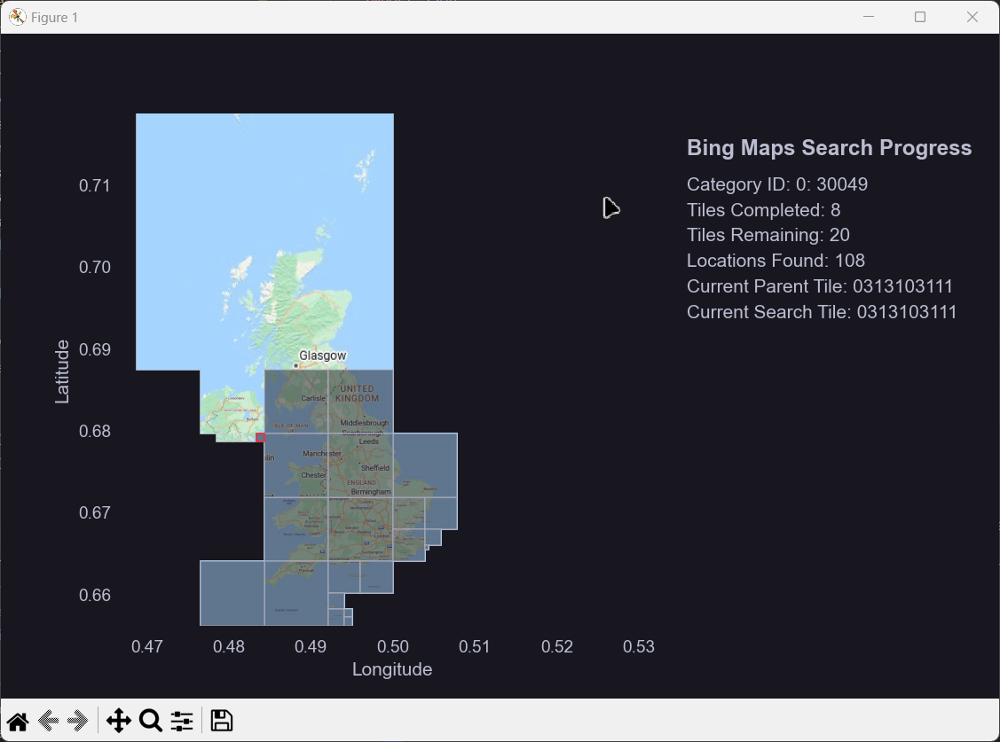

# Maps Scraper Project

#### A Bing Maps scraping tool for geospatial data extraction, recursive tile exploration, and data aggregation. This project includes utilities for data manipulation, saving, and visualisation of the scraping progress. 

#### The program also automatically geocodes the latitude and longitude of all results it finds, using preset GeoJSON configurations available in the `sidt` library. This geocoding feature maps each result to predefined regions or boundaries, enabling the aggregation and analysis of data by geographic area.
---

# Media

### The GIF demonstrates the progress of the scraper, visually tracking its exploration of map tiles over the United Kingdom. Each tile is checked recursively for location data, with new sub-tiles generated if the results exceed the result cap. The visualisation is created using matplotlib and updated with each request.
- **Left Panel**: Displays a map of the search area, with tiles shaded based on their search status. Lighter tiles have been processed, darker tiles have not yet been processed, and the tile outlined in red is the current search tile.
- **Right Panel**: Shows a real-time status update, including:
  - Category ID being processed
  - Number of tiles completed and remaining
  - Total locations found so far
  - IDs of the current parent and search tiles

---




## Project Structure

```bash
BM/
├── app/
│   ├── data/
│   │   ├── geojson/              # GeoJSON files for geospatial data
│   │   ├── resources/            # Additional resources for data processing
│   │   └── config.json           # Configuration file with tile sets and settings
│   ├── output/
│   │   └── samples/              # Sample output directories with scraped data
│   │       ├── apocalypse-us/
│   │       ├── europe-fire-stations/
│   │       ├── gas stations/
│   │       └── us_hunting_stores/
│   ├── main.py                   # Main application file
└── run.py                        # Entry point to run the scraper
readme_resources/                 # Additional resources for the README
requirements.txt                  # Python dependencies
```


## Dependencies

To run this project, you need the following Python packages:

- `matplotlib` - for creating plots and visualizations
- `seaborn` - for advanced data visualization
- `pandas` - for data manipulation and analysis
- `tqdm` - for progress bars
- `Pillow` (`PIL`) - for image processing
- `requests` - for making HTTP requests
- `sidt` - a custom package containing utility functions (`sidt.utils`)

You can install all dependencies at once by running:

```bash
pip install -r requirements.txt
```

